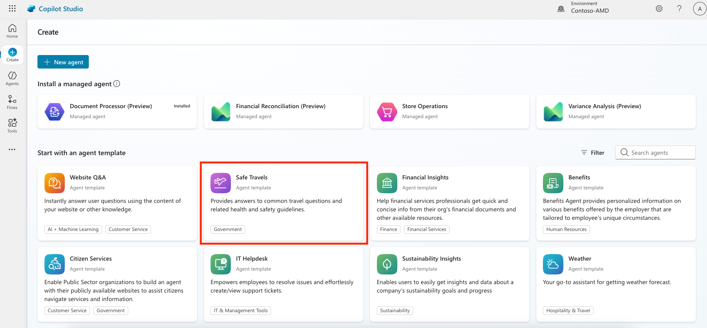
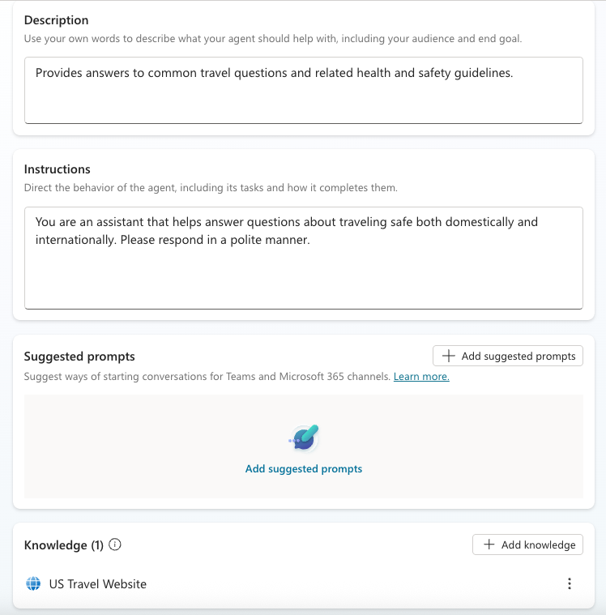
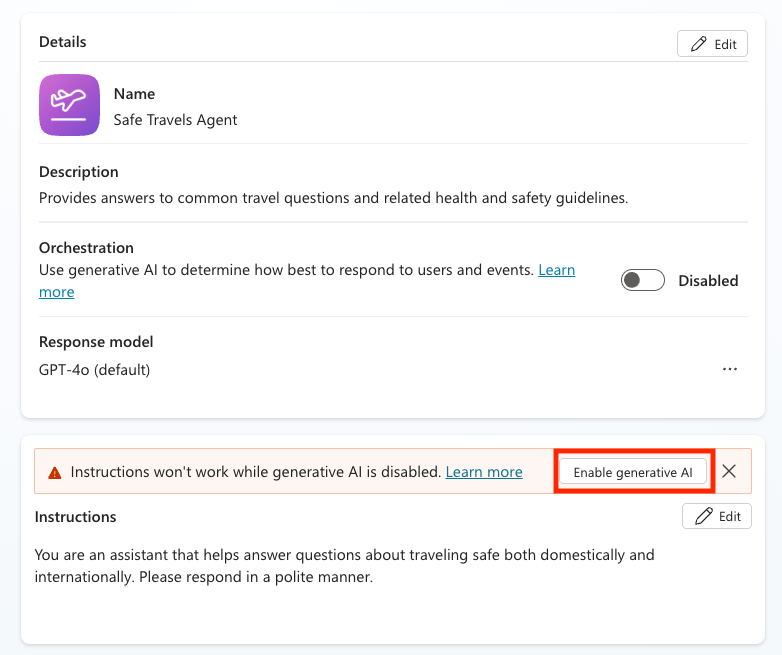
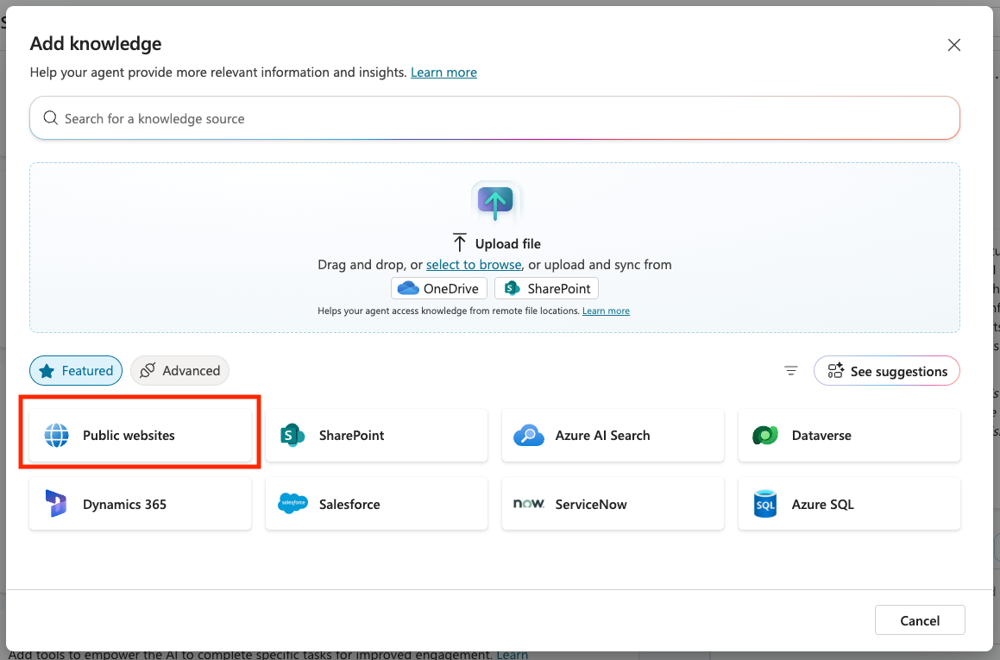
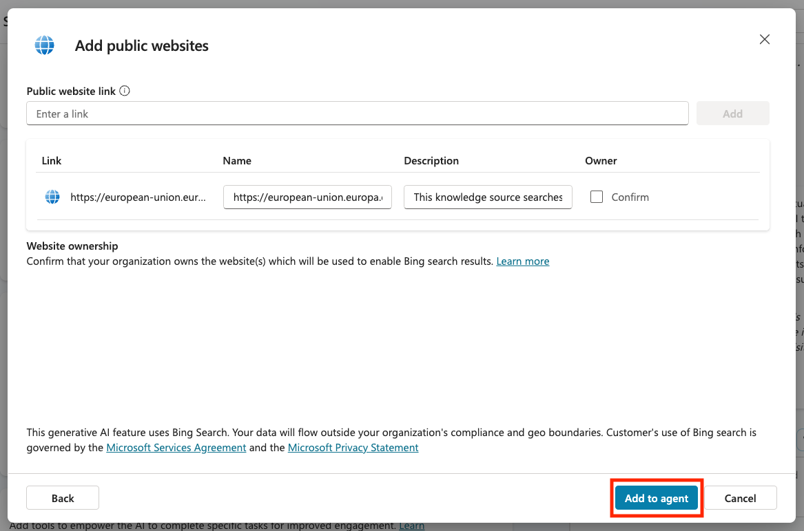

# 🧰 Mission 05: Using a Pre-Built Agent  

## 🕵️‍♂️ CODENAME: `OPERATION SAFE TRAVELS`

> **⏱️ Operation Time Window:** `~30 minutes`

🎥 **Watch the Walkthrough**

## 🎯 Mission Brief

Welcome to your next mission in the Copilot Studio Agent Academy. You're about to explore the world of **pre-built agents**—intelligent, purpose-driven agents created by Microsoft to accelerate your deployment and reduce time to value.

Rather than building from scratch, pre-built agents (also called **agent templates**) give you a head start by providing ready-to-use scenarios that you can customize and deploy in minutes.

In this mission, you’ll deploy the **Safe Travels** agent—an agent that helps your users prepare for business travel, understand company policies, and streamline planning.

---

## 🧭 Objectives

Your goals for this mission are:

1. Understand what pre-built agents are and why they matter  
1. Deploy the **Safe Travels** agent template  
1. Customize the agent’s responses and content  
1. Test and publish the agent  

---

## 🧠 What Are Pre-Built Agents?

Pre-built agents are turnkey AI agents created by Microsoft that:

- Address common business needs (like travel, HR, IT support)
- Include fully functioning topics, trigger phrases, instructions and sample knowledge.
- Can be edited, extended, and grounded with your own data

These agents are perfect for getting started quickly or learning how agents are structured.

---

## 🧪 Lab 05: Quickly get started with a pre-built agent

We're now going to learn how to select a pre-built agent and customize it.

- [5.1 Launch Copilot Studio](#51-launch-copilot-studio)
- [5.2 Choose the Safe Travels Agent Template](#52-choose-the-safe-travels-agent-template)
- [5.3 Customize the Agent](#53-customize-the-agent)
- [5.4 Test and Publish](#54-test-and-publish)

We're going to stick with the example from earlier, where we're going to create a solution in the dedicated Copilot Studio environment to build our IT helpdesk agent in.

Let's begin!

### 5.1 Launch Copilot Studio

1. Navigate to [https://copilotstudio.microsoft.com](https://copilotstudio.microsoft.com)

1. Sign in with your Microsoft 365 work or school account

!!! warning
    You must be in a tenant where Copilot Studio is enabled. If you don’t see Copilot Studio, revisit [Mission 00](../00-course-setup/README.md) to complete your setup.

### 5.2 Choose the Safe Travels Agent Template

1. From the Copilot Studio homepage, click **+ Create**
    

1. Scroll down to the **Start with an agent template** section

1. Find and select **Safe Travels**

    

1. Notice that the template comes pre-loaded with a description, instructions and knowledge.

    

1. Click **Create**

    

This will create a new agent in your environment based on the Safe Travels configuration.

### 5.3 Customize the Agent

Now that the agent is created, let’s tailor it to your organization:

1. Select **Enabled generative AI** to turn on the generative AI feature so that it can use the instructions provided in the template.

    

1. Now we'll equip the agent with an additional knowledge source so it can answer questions about Europe travel. To do this, scroll down to the **knowledge** section and select **Add knowledge**

    

1. Select **Public websites**

    

1. In the text input, paste **<https://european-union.europa.eu/>** and select **Add**

    

1. Select **Add to agent**

    

### 5.4 Test and Publish

1. Click **Test** in the top-right to launch the test window  

1. Try phrases like:

    - `“Do I need a visa to travel from the US to Amsterdam?”`
    - `“How long does it take to get a US Passport?”`
    - `“Where is the closest US embassy in Valencia, Spain?”`

1. Confirm the agent responds with accurate and helpful information and observe the Activity Map to see where it retrieved the information.

    

1. When ready, click **Publish**

    

1. Select **Publish** again in the dialog box
    

1. Optionally, add the agent to Microsoft Teams using the built-in **Channels** feature.

!!! note "🧳 Bonus Objective"
    Try grounding the Safe Travels agent with a SharePoint site or FAQ file to make it more relevant to your company’s travel policies.

## ✅ Mission Complete

You've now successfully:

- Deployed a Microsoft pre-built agent  
- Customized the agent
- Tested and published your own version of the **Safe Travels** agent template

⏭️ [Move to **Creating a custom agent from scratch** lesson](../06-create-agent-from-conversation/README.md).

<!-- markdownlint-disable-next-line MD033 -->

