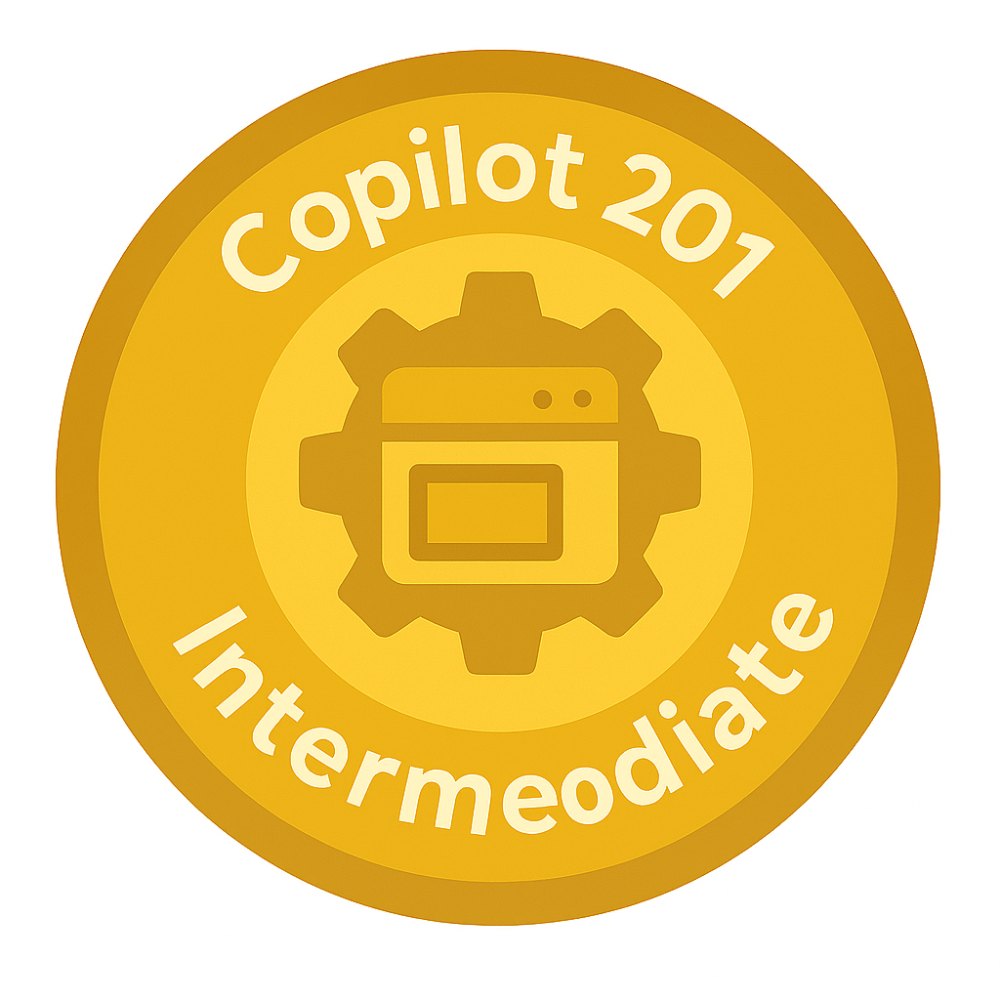
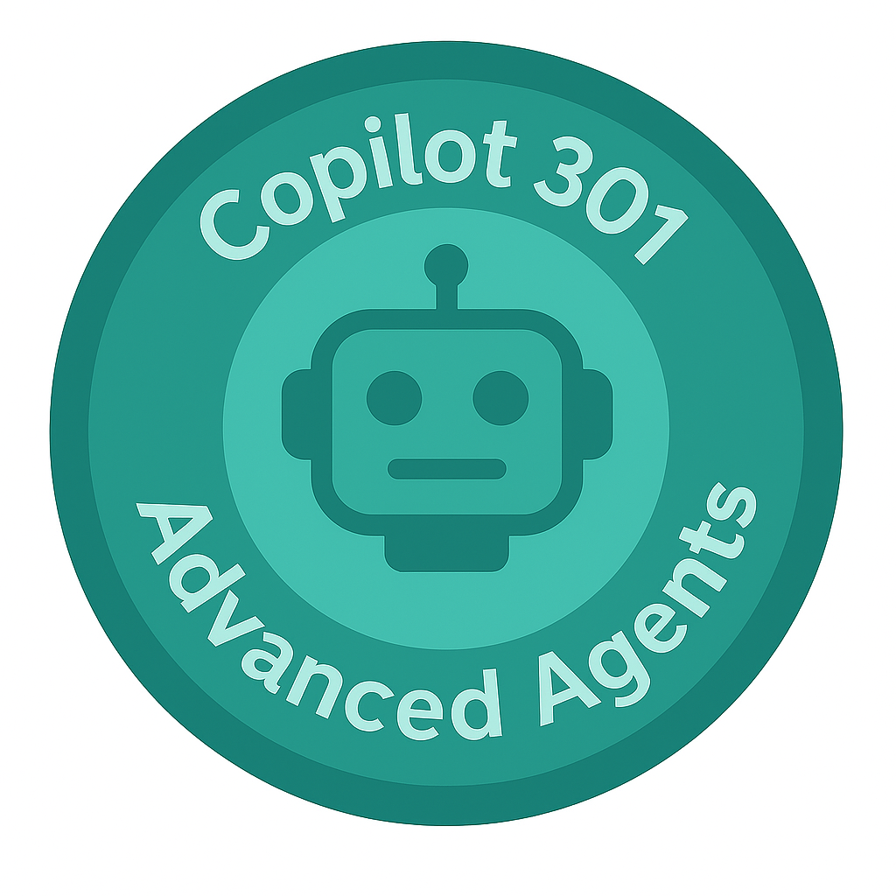
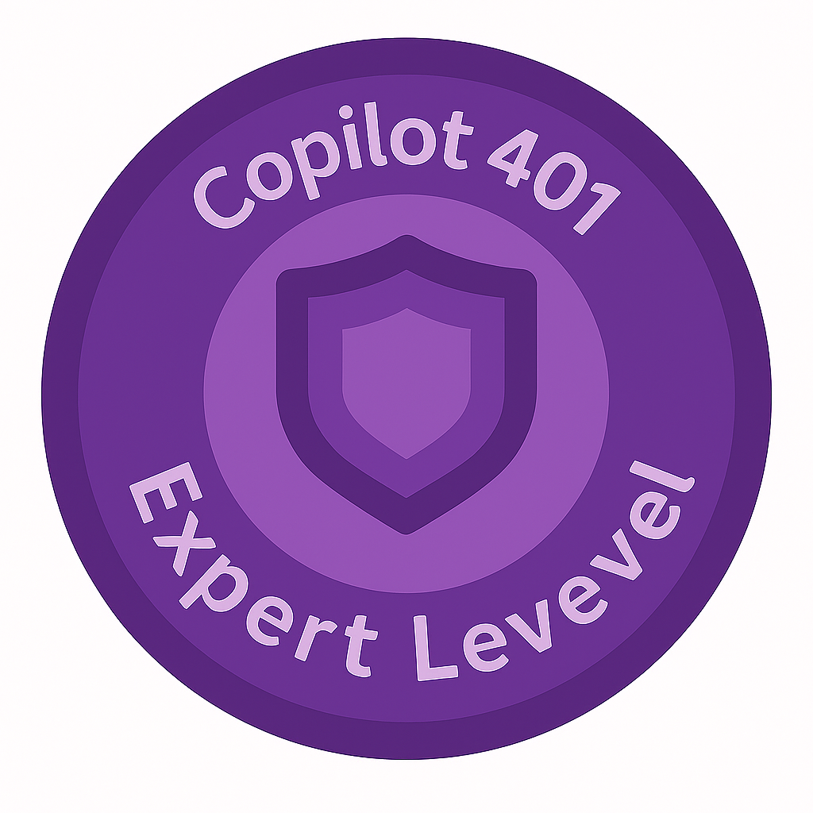

---
hide:
- navigation
---

# Copilot Studio Agent Academy

**Welcome to Copilot Agent Academy.**  

Welcome to Copilot Agent Academy, your guided journey to mastering the art of building intelligent agents with Microsoft Copilot technologies.

This course is designed to build your confidence and creativity across the full spectrum of AI fluency:

🧠 AI Foundations & Fluency — grasp the concepts behind large language models and generative AI.

💬 Prompt Crafting & Reasoning — learn how to think and communicate like an AI designer.

⚙️ Agent Builder (Copilot Studio Lite) — start constructing your first intelligent workflows using Microsoft Copilot Studio.

🪄 Copilot Studio Deep Dive — connect data, integrate actions, and extend your Copilots with custom logic.

☁️ Azure Agent Framework (coming soon) — move from concept to scale with the full Azure AI Agent Platform.

Whether you're a student, educator, or professional innovator, the Copilot Agent Academy empowers you to understand, build, and deploy real-world AI agents that make both work and learning smarter.

---

## 🏅 Rank Progression

The **Copilot  Agent Academy** is a multi-phase training program designed to build your skills across five courses. Each level includes a badge and increasing responsibilities:

| Rank | Level | Badge |
|------|:-----:|-------|
| 🟢 [**Copilot 099** 🚀 Get started](Copilot-099.md) | Foundations |    |
| 🔵 [**Copilot 101** (Coming Soon)](Copilot-101.md) | Core Concepts |    |
| 🟡 [**Copilot 201** (Coming Soon)](Copilot-201.md) | Intermediate |    |
| 🔵 [**Copilot 301** (Coming Soon)](Copilot-301.md) | Advanced Agents |    |
| 🟡 [**Copilot 401** (Coming Soon)](Copilot-401.md) | Expert Level |    |

Each level builds on the last. Finish your Copilot 099 mission and get ready to level up!

---

## 🎒 Other Courses

Check out these other courses to continue learning about AI and Agents:

- [Microsoft Copilot Studio <3 MCP Lab](https://aka.ms/mcsmcplab)
- [Copilot Developer Camp](https://microsoft.github.io/copilot-camp/)
- [AI Agents for Beginners](https://microsoft.github.io/ai-agents-for-beginners/)
- [Model Context Protocol (MCP) For Beginners](https://github.com/microsoft/mcp-for-beginners)

---

## 🚑 Issues

We really appreciate your feedback! Please use the [issues list](https://github.com/microsoft/agent-academy/issues) to share your comments and issues. Thanks!

---

## 📜 Code of Conduct

This project has adopted the [Microsoft Open Source Code of Conduct](https://opensource.microsoft.com/codeofconduct/).

!!! info "Resources:"

    - [Microsoft Open Source Code of Conduct](https://opensource.microsoft.com/codeofconduct/)
    - [Microsoft Code of Conduct FAQ](https://opensource.microsoft.com/codeofconduct/faq/)
    - Contact [opencode@microsoft.com](mailto:opencode@microsoft.com) with questions or concerns

---

[⭐️ Star our repo](https://github.com/microsoft/agent-academy){ .md-button .md-button--primary }

<!-- markdownlint-disable-next-line MD033 -->

